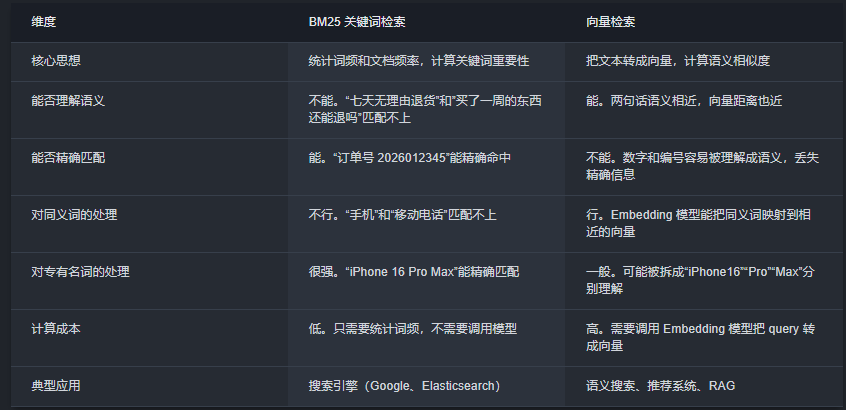
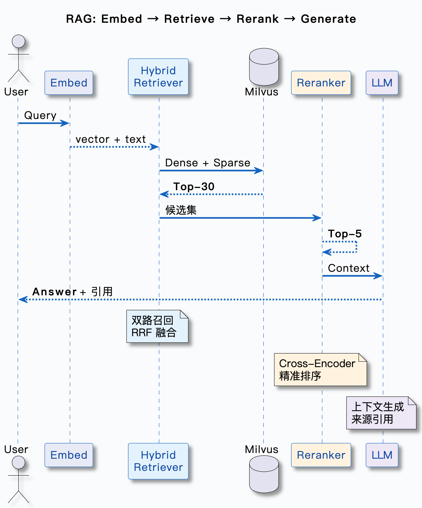

# 前言

---

既然向量语义检测已经足够好了，那么我们为什么还要检索策略与召回优化？

事实上，语言检测有很明显的缺陷，对于时间相关chunk尤其如此，比如有**Query:"2026年春节家电出货量为？"**，他可能会只去匹配春节、家电、出货量。导致效果非常不理想，此时应该使用**关键词匹配**。

## 关键词检索算法BM25

---

简单介绍，BM25是一个经典关键词检索算法，是ElasticSearch的默认排序算法，也是**混合检索**中关键词检索的核心

### 核心原理

---

不去理解语义，靠三个核心因素解决问题

- **词频** 出现频率越高则越相关，但有一定上限，避免过高频词干扰
- **逆文档频率** 越稀有的词越有区分度，比如具体的型号：文章里不会到处都是'RTX5090'，频率越低，权重越大
- **文档长度归一化** 不能因为长文档相关词的绝对出现频率更高就返回长文档，这个很好理解

### 总结

关键词匹配解决不了语义问题，比如**我不想要了**匹配不上**我想退货**。
向量检索解决不了对专有名词的处理，比如他无法区分STM32F103和STM32F107（在很长一段Query检索中）

不应该只取其一，而应该结合使用

Milvus原生支持BM25算法，可以选一个标量字段用于全文检索

## 混合检索：向量＋关键词

---

### 混合检索基本流程：

- **Query1**
- **向量检索(Res1)**
- **Query2**
- **关键词匹配(Res2)**
- **RRF融合(Res1|Res2)**
- **返回综合结果**

---

### 架构方案

- **Milvus**原生混合检索
  - 架构简单，成本低
  - 避免一致性问题
  - 能力一般
- **ES + Milvus**双系统，各自负责擅长的匹配，应用层做融合
  - 能力强
  - 复杂
  - 数据一致性问题

---

### 分数融合难题

COSINE返回的相关度是0-1，BM25返回的相关性分数是0 -> ∞，不可以直接对比。
BM25又不能直接映射到0-1，分布不均也会导致不公平

#### RFF（倒数排名融合）

很简单，不依赖分数，只看排名
> RRF(d) = Σ 1 / (k + rank_i(d))
> k是平滑常数

Just Choose It

---

## 重排序

**Why?** 召回阶段追求的是快速找回尽可能的结果，确实是按相关性来召回的，但是并不一定完全准确，所以需要重排序找到真正最准确的chunk，塞给大模型

**工作原理**
- **初检阶段** 快速召回候选集
- **重排序模型**逐个评估chunk和用户问题的相关性，进行打分
- **重新排序**，取topK为最终结果

重排序是有专门的Reranker模型来做的

混合排序＋Reranker是效果最好的，但是成本和延迟会比较高

然后有Bi-Encoder和Cross-Encoder的概念，Bi-Encoder就是把query和chunk分别向量化，计算相似度，也就是初检阶段我们的操作。Cross-Encoder是把query和chunk拼接在一起，输入模型，由模型处理计算出一个相关性分数，精度会更高，但是速度会更低（幂方复杂度，输入越多，模型的反应越慢）

所以有了快召回和慢精排结合的思路

---

## 总结

混合检索 + 重排序的流程为

**小结**
在语义匹配的基础上，探讨了由关键词/语义匹配结合而来混合检索，这里涉及到了BM25算法和两种架构，混合检索的关键是RFF(倒数排名融合)，排除了不同量化的影响，效果最好，对大值不敏感。在混合检索的基础上，进一步发展了重排序，使得最终传给模型的chunk更贴近query，这里涉及到了Bi-Encoder和Cross-Encoder的区分，和Rerank模型。

Updated on 5/14/2026