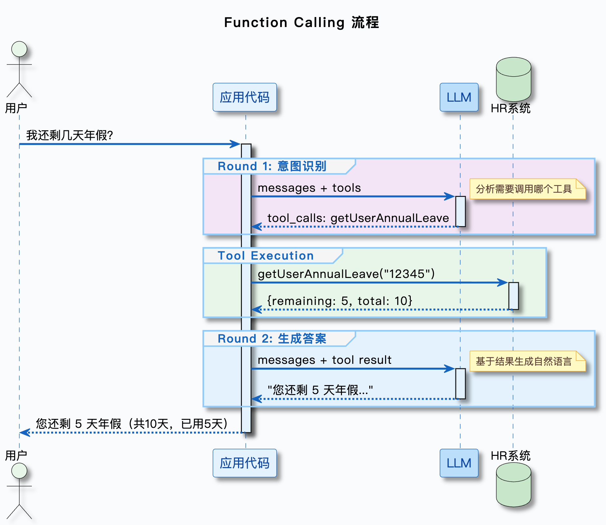

## 前言

事实上，Rag的生成工作已经结束了，复习一下，主要流程就是。

Query -> 混合检索 -> Rerank -> Prompt -> 返回结果

我们已经做的无可指摘了，但是还是不够，比如， **用户问，我有多少积分？我有多少优惠券？** 这些数据是不放在知识库里的，只靠Rag检索增强生成是得不到答案的。

怎么解决？

---

## 从查知识库到干活

怎么让系统解决上述问题？

- 兜底回复，甩给用户一个url，让用户自己去办理。
  - 明显不够智能
- 规则匹配，调用对应的接口
  - 不现实，业务太多且变动频繁，不可能一次把所有规则全考虑到，维护成本太高

所以我们需要一个更好的解决方法

---

## Function Call

一句话说明白Function Call，他就是模型输出调用意图。模型不是真的调用了函数，而是输出了一个JSON，告诉后端，我觉得该调用这个函数了，然后由外界去执行。**模型本身没有调用函数的能力。**

**流程如下：**

- 定义工具或者说函数（名字，描述，参数）
- 把工具列表和Prompt一起发给模型
- 模型判断需要调用哪个工具，输出一个Json，包含了函数名和参数
- 解析JSON，执行对应的函数，拿到结果
- 把函数执行结果返回给模型
- 模型基于输出生成最终答案

流程还是比较简单的



Function Calld的特点

- 标准化，可拓展，安全
- 动态，无感
- 理解力强，免训练，覆盖广
- 结构化，安全，可靠

---

## OpenAI Function Call协议

这是一套由OpenAI提出的标准，目前主流大模型覆无常都支持这个协议，核心是定义工具的格式和模型响应的格式。

### 工具定义格式（Tools数组）

```json
{
  "type": "function",
  "function": {
    "name": "getUserAnnualLeave",
    "description": "查询用户的年假余额，包括总天数、已使用天数、剩余天数",
    "parameters": {
      "type": "object",
      "properties": {
        "userId": {
          "type": "string",
          "description": "用户 ID"
        }
      },
      "required": ["userId"]
    }
  }
}
```

一看就懂了，不过多描述

完整Http请求示例：

```json
{
  "model": "Qwen/Qwen2.5-7B-Instruct",
  "messages": [
    {
      "role": "user",
      "content": "我还剩几天年假"
    }
  ],
  "tools": [
    {
      "type": "function",
      "function": {
        "name": "getUserAnnualLeave",
        "description": "查询用户的年假余额",
        "parameters": {
          "type": "object",
          "properties": {
            "userId": {
              "type": "string",
              "description": "用户 ID"
            }
          },
          "required": ["userId"]
        }
      }
    }
  ],
  "tool_choice": "auto"
}
```

### 响应格式：模型输出tool_calls

```json
{
  "choices": [
    {
      "message": {
        "role": "assistant",
        "content": null,
        "tool_calls": [
          {
            "id": "call_abc123",
            "type": "function",
            "function": {
              "name": "getUserAnnualLeave",
              "arguments": "{\"userId\": \"12345\"}"
            }
          }
        ]
      },
      "finish_reason": "tool_calls"
    }
  ]
}
```


### 函数执行结果返回给模型

```json
{
  "model": "Qwen/Qwen2.5-7B-Instruct",
  "messages": [
    {
      "role": "user",
      "content": "我还剩几天年假"
    },
    {
      "role": "assistant",
      "content": null,
      "tool_calls": [
        {
          "id": "call_abc123",
          "type": "function",
          "function": {
            "name": "getUserAnnualLeave",
            "arguments": "{\"userId\": \"12345\"}"
          }
        }
      ]
    },
    {
      "role": "tool",
      "tool_call_id": "call_abc123",
      "content": "{\"remainingDays\": 5, \"totalDays\": 10, \"usedDays\": 5}"
    }
  ]
}
```
### 最终输出

```json
{
  "choices": [
    {
      "message": {
        "role": "assistant",
        "content": "您还剩 5 天年假（总共 10 天，已使用 5 天）。"
      },
      "finish_reason": "stop"
    }
  ]
}
```

---


## 小结

总计一下，Rag的生成功能已经基本完善，但是我们需要rag足够智能，也就是需要它能够去动态的获得某些**不存在于知识库**的数据，FunctionCall解决了大模型**需要动态调用函数**的问题，定义了一套标准规范。主要流程是，在发起模型调用时，附带tools参数，告知模型有哪些工具可用。模型会发会方法调用的json参数tool_calls（如果触发的话），此时需要我们处理json，实际调用后，把完整的上下文一起返回给模型，由模型最终生成回复。

模型自己并不会真的去调用函数，而是输出一个**调用意图**

但是生产中手写JSONSchema太过麻烦，维护成本高，跨语言还需要自建集成层，没有统一的框架，调用链的链路需要自行实现，所以引出了**MCP**

Update on 5/15/2026