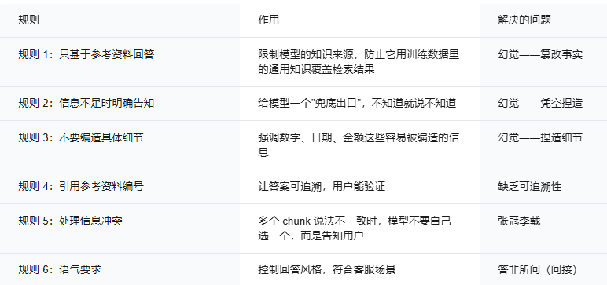
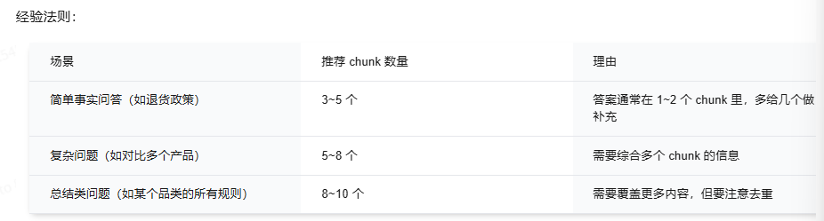

## 前言

在前面，我们已经通过混合检索+重排序获得了相对准确的Chunk，那么可以直接使用了吗？答案还是**不行**

原因是大模型存在幻觉，即便Chunk已经十分精准，给出的答案仍然可能不可用，幻觉会凭空捏造和篡改关键部分

Rag面临的挑战有

- 幻觉
- 答非所问
- 缺乏可追溯性


这就需要 **Prompt** 发力了

---

## RAG Prompt的结构

通常结构如下

- **系统指令** 也就是模型的身份定义
- **检索上下文** 也就是召回重排序后的Chunk
- **用户问题** 也就是用户的原始Query

下面详细说一下

---

### 1.系统指令

是模型回答的Base场景，是整个Prompt的总纲，决定了模型的行为，最核心的任务是，**让模型只基于召回的上文问去回答问题，不要自由发挥**（避免幻觉）

参考

```
你是一名专业的电商客服助手。你的任务是根据【参考资料】中的信息，准确回答用户的问题。

请严格遵守以下规则：
1. 只基于【参考资料】中的内容回答问题，不要使用你自己的知识。
2. 如果【参考资料】中没有足够的信息来回答用户的问题，请明确回答："根据现有资料，暂时无法回答该问题。建议您联系人工客服获取更多帮助。"
3. 不要编造任何【参考资料】中没有提到的信息，包括数字、日期、金额等具体细节。
4. 回答时请引用参考资料的编号，格式为 [1]、[2] 等，标注在相关句子的末尾。
5. 如果多条参考资料的信息存在冲突，请指出冲突并告知用户以最新的资料为准。
6. 用简洁、友好的语气回答，避免过于官方或生硬的表述
```

**分析：**



设计Prompt的时候要考虑一下几点

- 不能太短，作用会很小
- 不能太长，指令会冲突，上下文开销也会很大
- 没有兜底指令，这样模型会自己发挥，也就是幻觉率很高，应该明确告知，条件不足时怎么办
  
考虑以上几点的Prompt，效果就会非常好

### 2.检索上下文

也就是把TopK的Chunk喂给大模型，需要考虑的是

- 上下文的组装格式
  - 最好是每个Chunk带编号，带来源信息，用分隔符隔开，可以举个例子
    ```
    【参考资料】
    [1] 来源：退货政策文档 | 更新时间：2026-01-15
    iPhone 16 Pro Max 因屏幕定制工艺，拆封后不支持七天无理由退货。如需退货，需经售后检测确认存在质量问题。
    ​
    [2] 来源：通用退货规则 | 更新时间：2026-01-10
    标准商品在签收后 7 天内可申请无理由退货，商品需保持完好，不影响二次销售。
    ​
    [3] 来源：退货运费规则 | 更新时间：2026-02-01
    质量问题退货，运费由商家承担；非质量问题退货，运费由买家承担。
    ```
- 上下文窗口大小的限制
  - 尽管限制大模型的窗口已经很大，256K甚至是1M，但是并不代表塞的越多越好用，大模型的注意力机制导致，他只能利用到窗口中的一部分Chunk，大多数的内容会被稀释，还有**迷失在中间（LostintheMiddle）**，同时还有刚才设计prompt时说的，会带来很大的开销。所以要考虑Chunk的数量



### 用户问题

对于大多数场景，直接将用户的Query原封不动的塞给大模型也就够了，但是部分场景下，用户指令不清晰，或者有歧义。此时就不能直接塞给大模型了。

此时就要考虑**Query改写（Rewriting）**来优化，不过本章暂不考虑

### 完整Prompt演示

```
【System】
你是一名专业的电商客服助手。你的任务是根据【参考资料】中的信息，准确回答用户的问题。
​
请严格遵守以下规则：
1. 只基于【参考资料】中的内容回答问题，不要使用你自己的知识。
2. 如果【参考资料】中没有足够的信息来回答用户的问题，请明确回答："根据现有资料，暂时无法回答该问题。建议您联系人工客服获取更多帮助。"
3. 不要编造任何【参考资料】中没有提到的信息，包括数字、日期、金额等具体细节。
4. 回答时请引用参考资料的编号，格式为 [1]、[2] 等，标注在相关句子的末尾。
5. 如果多条参考资料的信息存在冲突，请指出冲突并告知用户以最新的资料为准。
6. 用简洁、友好的语气回答，避免过于官方或生硬的表述。
​
【参考资料】
​
[1] 来源：退货政策文档 | 更新时间：2026-01-15
iPhone 16 Pro Max 因屏幕定制工艺，拆封后不支持七天无理由退货。如需退货，需经售后检测确认存在质量问题。
​
[2] 来源：通用退货规则 | 更新时间：2026-01-10
标准商品在签收后 7 天内可申请无理由退货，商品需保持完好，不影响二次销售。
​
[3] 来源：退货运费规则 | 更新时间：2026-02-01
质量问题退货，运费由商家承担；非质量问题退货，运费由买家承担。
​
【用户问题】
iPhone 16 Pro Max 拆封后还能退吗？
```

示例回复：
```
iPhone 16 Pro Max 拆封后不支持七天无理由退货，因为该机型采用了屏幕定制工艺 [1]。
​
不过，如果您收到的商品存在质量问题（比如屏幕有坏点、机身有划痕等），可以申请退货，需要经过售后检测确认 [1]。
​
需要注意的是，如果是因为质量问题退货，运费由商家承担 [3]。
```

## 幻觉抑制

幻觉不详细说了，知道是大模型的特性，主要有以下几种幻觉

- 篡改事实
- 凭空捏造
- 张冠李戴

像刚才说的，抑制幻觉我们可以通过Prompt来限制大模型自由发挥

- **明确限定知识来源**
  - 只基于【参考资料】中的内容回答问题，不要使用你自己的知识。
- **加兜底指令**
  - 如果【参考资料】中没有足够的信息来回答用户的问题，请明确回答："根据现有资料，暂时无法回答该问题。建议您联系人工客服获取更多帮助。"
- **禁止编造具体细节**
  - 不要编造任何【参考资料】中没有提到的信息，包括数字、日期、金额等具体细节。
- **要求先引用再回答**
  - 回答时请引用参考资料的编号，格式为 [1]、[2] 等，标注在相关句子的末尾。

除此以外，还可以通过调整模型的参数来抑制幻觉，有两个参数

- **Temperature**
  - 简单地说，就是大模型输出的随即程度，越小随机的概率就越小，幻觉率也就会越低，范围从0-1
- **Top-P**
  - 也是一种控制随机性的方式，Top-P = 0.9表示只从累积概率达到90%的候选词中采样，排除概率极低的词

参考参数设置

- Temperature 0-0.3
- Top-P 0.9-0.95

此外还有

**引用对齐**（可追溯性）
为什么需要引用对齐（企业合规、审计、信任），以及如何实现：Chunk 带编号、Prompt 要求标注 [1][2]、后端用正则解析引用并关联元数据。

**答案约束**（格式、长度、边界）
可以控制输出格式（纯文本/JSON/列表）、回答长度（简短/详细/限字数）以及领域边界（只回答售后问题，不答品牌对比等）。

---

## 小结

这篇我们主要通过Prompt和大模型的参数来解决了Rag生成的最后一公里问题，也就是通过Prompt来限制大模型的输出，设定他的身份，如何回复，怎么找答案，没有答案的时候怎么办，只有把大模型限制住，才能更加稳定的输出我们想要的结果

至于Prompt，你想，他就是喂给大模型的直接文本，主要就是三段，第一，系统身份设定，第二，如何检索上下文（边界条件集中在这里），第三，用户Query，这里还提了下QueryRewriting，但是没有细说，后边会有，本章就到这里了

Updated on 5/15/2026