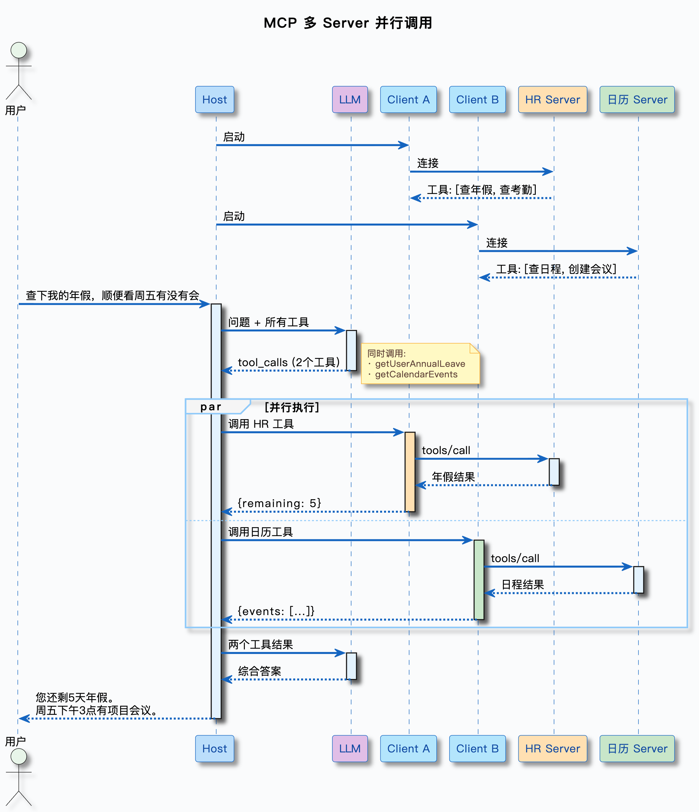

## 前言

上节已经学了Function Call，但是暴露了很多严重的问题

- 静态绑定，每次调用都需要在请求中完整列出所有可用函数的名称，描述和参数schema，如果有新工具，需要修改代码，重新传入定义，维护困难
- 缺乏统一标准，生态割裂。尽管Function Call是统一的的标准，但是不同的工具和框架，语言等可能会有不同的实现，导致兼容性问题
- 只有单向请求-响应，不支持主动推送和流式状态
- 上下文管理讲话，工具数量受限且浪费token
- 不支持原生的权限管理
- 确实观测性

处于以上原因，MCP协议被提出，它是一个基于JSON的协议，用于在不同系统之间进行通信。

---

## 什么是MCP

### MPC核心思想

MPC，Model Context Protocol，模型上下文标准。核心思想一句话，**任何工具只要实现了MCP协议，就能被任何支持MCP的客户端调用，不用关心对方是什么语言，什么平台**

### MCP三层架构

MCP主要有三层架构

- **Host** 用户直接交互的应用，比如Claude Desktop，Cursor，Ragent等
- **Client** 是Host的内部通信组件，负责与Server进行通信，一个Client只连接一个Server，一个Host可以有多个Client
  - 与Server简历连接
  - 发现Server的工具列表
  - 调用Server的工具并获取结果
  - 管理连接的生命周期
- **Server** MCP服务提供商，可以是本地的，也可以是云端的
  - 声明提供哪些工具
  - 接收Client的调用请求
  - 执行工具逻辑并返回结果

调用流程：

### MCP三大核心能力

#### Tools 工具调用

是MCP最核心的能力，和Function Call直接对应的部分

- **FucntionCall** 工具定义在客户端代码中（Json Schema），和模型交互的时候一起发送
- **MCP** 工具定义在Server端，Client通过协议动态获取

#### Resource 资源访问

Server可以暴露资源给Client读取，比如
- 文件内容
- 数据库记录
- API返回的数据

Resource和Tools的区别是Tools是执行操作，Resource是提供数据，Resource可以给模型提供额外的上下文信息

#### Prompt 模板

Server可以提供预定义的Prompt模板，Client可以使用这些模板来构建和模型的交互，比如代码审查模板等，和Resource有一点像，主要对应获取资源操作，比较少用。

### MCP VS Function Call

MCP是替代Function Call的吗？

**不是**，MCP底层依赖Function Call，准确的说，是一种基于Function Call的协议，MCP做的是在Function Call之上，提供一层标准化的管理框架，有点像适配器模式，给Function Call添加了更多功能。

### MCP传输机制

MCP的Client和Server是如何通信的？
MCP定义了Stdio，和Streamable HTTP（可流式HTTP）

#### Stdio

这种情况，MCP Server作为本地进程运行，Client通过OS的stdin和stdout和Server进行通信。

流程：

- Client启动Server进程
- Client向Server的stdin写入JSON-RPC请求
- Server从stdin读取请求，执行工具，把结果以JSON-RPC格式写入stdout
- Client从Server的stdout读取结果，解析为响应

> JSON-RPC是一种轻量级远程调用协议，用JSON格式传输请求。

#### Streamable HTTP

此方案替代了早期的HTTP + SSE方案，通过HTTP请求调用

流程：

- Server启动HTTP服务，监听某端口
- Client向Server发送HTTP POST请求（JSON-RPC格式）
- Server处理请求，返回HTTP响应
- 如果需要流式返回，Server通过SSE推送增量结果

优点：

- 支持远程访问
- 支持团队共享
- 支持流式响应，适合长时间运行的工具
- 可以利用HTTP的生态

缺点：

- 需要网络配置
- 多了网络RT开销

---

## 总结

代码的具体实现就不再赘述了，本篇主要就是介绍了MCP，为什么要有MCP，MCP的传输机制（stdio，streamable http），三种核心能力（工具调用，资源获取，prompt模板），顺带一提，感觉Spring Ai的框架还挺好用的，@Tool注解就行。

然后MCP在实际中的应用就是，可以把知识检索封装为MCP组件，多Server协同工作，企业级工具管理。

Updated on 5/15/2026