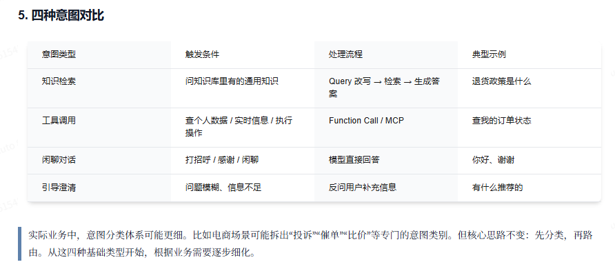
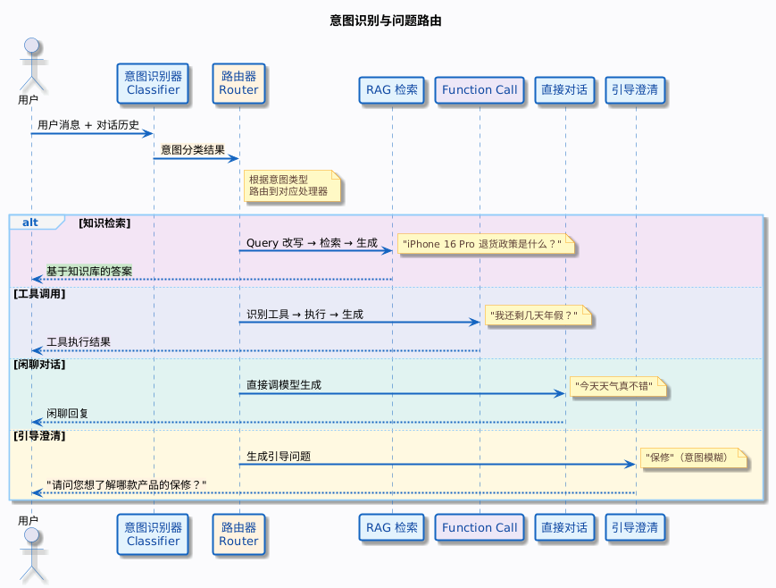
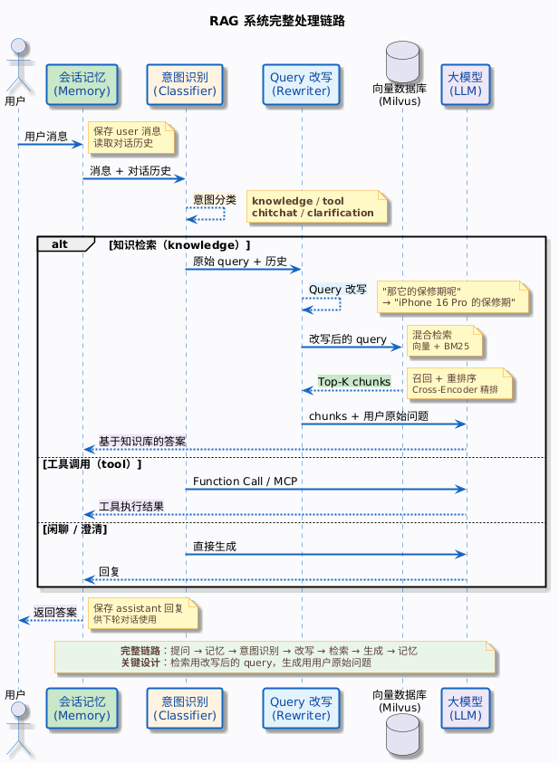

## 前言

之前我们结束了查询重写，但是并不是万事大吉，还需要继续完善。

试想一个场景，用户输入 **"我还有几天年假"** ，系统会按照流程，重写意图，向量化，混合检索，得到年假策略chunks，最后交给llm生成回答。

用户看到：**根据公司年假制度，正式员工每年享有 10 天带薪年假。**

这不是扯淡吗，他应该去调用年假策略接口，获取用户具体的年假天数。

尽管FunctionCall/MCP可以让模型主动调用，但是不是万能的，意图识别是更高层的设计。

> Function Calling 的触发通常由大模型自行判断，但在复杂业务中，直接让模型在数十乃至上百个函数中做选择，会出现严重的准确率下降、延迟增加和成本飙升。

把他独立出来，才是更好的设计。

- 意图识别是前台接线员，他快速判断你的来意，是咨询、报修还是投诉，然后决定转给谁，并让你把初步信息填好。
- Function Calling是后台技术工单系统，接线员确定是“报修”后，再在系统里精准地下达一个带参数的任务单：“维修员，去XX地址修空调”。

---

## 意图类型

不同场景下用户通常会有不同的意图，电商场景下，用户主要有四种意图，看到以下场景，通常就会看懂为什么需要意图识别了。

- 知识检索
- 工具调用
- 闲聊对话
- 引导澄清

---

## 意图识别的方案

### 规则匹配

比如有关键词匹配，直接进行一个匹的配

### 大模型分类

设计好prompt，交给大模型来做意图识别，**大模型真是个好东西！**

### 混合方案

计算机经典中庸之道，可以用规则匹配先做第一层过滤，然后再用llm做第二层的精准分类。

这样可以节省token, 同时也可以提高分类的准确率。

---

## 路由的架构设计

### 路由器模式

路由器负责拿到意图分类结果后，调用对应的处理器，每个处理器负责自己的逻辑，互不干扰。

核心就是一个switch

### 意图识别在链路中位置

在会话记忆加载之后，在Query改写之前。

为什么在会话记忆之后？因为意图识别可能需要对话历史来做判断。用户说“好的，帮我退了吧”，如果不知道前面在聊什么，无法判断这是工具调用（确认退货操作）。

为什么在 Query 改写之前？因为 Query 改写只在知识检索路径上才需要。如果意图是闲聊或工具调用，根本不需要做 Query 改写，直接走对应的路径就行。

> 但是实际的落地中，还是选择了先重写再意图识别，因为大多数情况还是要基于知识库问答进行查询。

---

## 小结

到此，Rag的链路问答系统就完善了。

主要的流程是

Question -> LoadMemory（把会话记忆加载出来） -> RewriteQuery(进行归一化和结合上下文与prompt交给llm重写) -> 意图识别 -> 路由 -> 生成回答

**Updated on 5/16/2026**