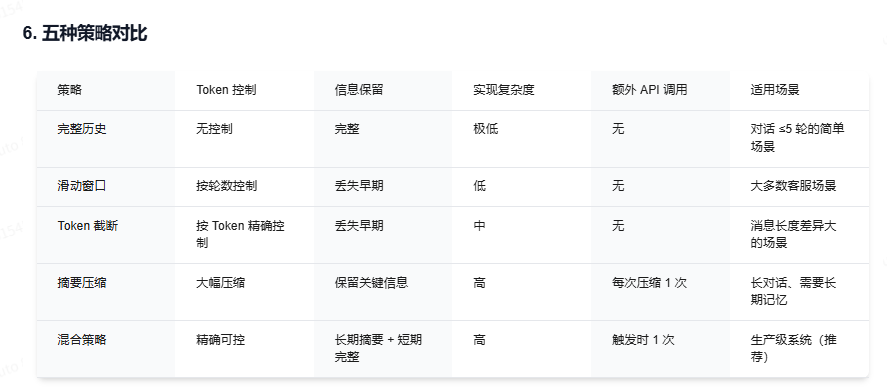
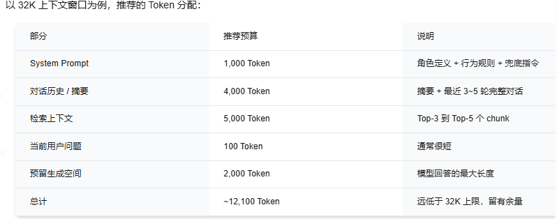
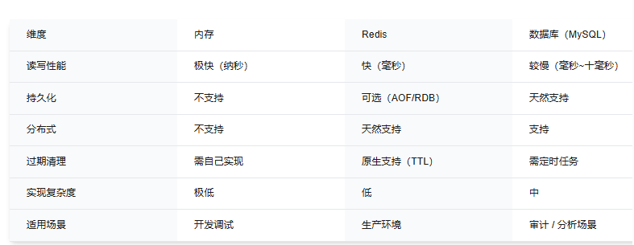

## 前言

我们的Rag现在的流程已经非常完美了。数据分块 → 元数据管理 → 向量化 → 向量数据库 → 检索策略 → 生成策略 → Function Call → MCP 协议。

但是还有一个问题，大模型是没有记忆的。也许只用大模型不了解原理的人会感到困惑，怎么会没有记忆的，但那是已经封装好的服务。对于调用大模型来说，大模型是没有状态的，我们说的记忆，**本质是向context里不断的添加说过的话**。

所以如何设计多轮对话，是非常值得考量的。

---

## 多轮对话设计

那么怎么设计呢？
首先从最基本的思路出发，**我们可以在每次对话结束后，将当前对话的context保存起来，下一次对话时，再将这个context作为输入，这样就可以实现多轮对话了。**

但是这样有一个问题，就是context的长度会无限增加，导致大模型的推理时间增加，影响用户体验。**Token开销无敌巨大多**，同时，**超出大模型上下文窗口，幻觉和遗忘率暴增**，所以肯定是不能这么做的，不过这是最基本的思路，我们后边要在这个基础上进行改进。

### 多轮对话记忆策略

#### 1.完整历史

就是刚才说的那个，实际使用根本不可能，如果能确保只有几轮对话，那么就可以接受。

#### 2.滑动窗口

一句话说明白，只保留最近的N轮对话，更早的直接丢弃。

优点

- 实现简单
- Token可控

缺点

- 不能按语义保留关键信息

N值的选取比较看场景和经验，一般从五轮开始调节，如果用户频繁出现丢失上下文的情况，适当调大N值。

#### 3.Token截断

本质也是滑动窗口，在对话轮数的基础上，看消耗的token数。

但是这样也有个问题，不同对话的token数是不同的，如果五轮消耗的token都很少，那么就会丢失很多信息。体验也会很差。

#### 4.摘要压缩

一句话，用大模型来压缩context，保留关键信息。

此时，触发压缩的时机可以用之前提到的Token截断策略或者N轮对话策略，又或者是检测到用户切换话题时，主动压缩。

#### 5.混合策略

依旧计算机中庸之道，可以**早期对话压缩成摘要，最近N轮保留完整对话**
兼顾了**长期记忆**与**短期精度**

---

## Token预算分配

Context的总量是有限的，我们需要进行分配，首先要知道有哪些成分

- **System Prompt** 必须 固定开销
- **对话历史/摘要** 必须 动态增长开销
- **Top-K Chunks** 对于Rag来说是必须的 动态开销
- **用户输入** 必须 动态开销，但一般不会太大
- **生成空间** 必须 动态开销

> 一般不要用满模型的上下文窗口，否则会导致幻觉和遗忘率暴增。

### Token预算分配优先级

优先级如下

- **System Prompt**
- **生成空间**
- **对话历史** 这里包含了用户输入
- **检索上下文**
- **更早的对话历史**

### 分配策略

我们可以根据当前对话历史的Token数，动态调整Chunks或者历史对话的数量，实际上，也只有这两个地方可以调了

- 对话刚开始（历史 Token 少）→ 可以多放几个chunk，检索信息更丰富
- 对话中期（历史 Token 适中）→ chunk 数量正常
- 对话后期（历史 Token 多）→ 减少 chunk 数量，或者触发摘要压缩腾出空间

---

## 会话记忆的存储方案

### 内存存储

简单，快速，但是内存有限，不能存储大量的会话记忆。重启后数据全丢，智能单机使用。

### Redis存储

分布式，高性能，自带过期机制。需要序列化/反序列化，重启也会丢数据，不过可以持久化，适合生产环境。

### 数据库存储

持久化，可审计，可以做数据分析，但是读写性能差，不适合高并发场景。

### 选型

> 生产环境推荐方案：Redis做主存储+MySQL做归档 。对话进行时，消息存 Redis（快速读写）；对话结束后，异步写入 MySQL（持久化、审计）。

## 注意事项

### 1.会话超时与清理

这里我的看法是做**冷热数据**，我们就不用内存存储了，就用Redis进行读取，当超过一定时间，比如用户关掉页面，或者半小时不说话后，就让Redis自动清理，但是MySQL中的数据会保留。后续用户再次打开页面，数据可以从MySQL恢复。

### 2.敏感信息处理

用户可能会输入身份证号，手机号等，存储的时候需要进行脱敏处理

- 脱敏存储
- 加密存储
- 访问控制

### 3.对话历史可观测性

最好能做到监控，比如

- Token消耗
- 是否触发了压缩
- 响应时间
- 记忆命中率

## 小结

本篇内容是在实现了工具调用的基础上，进一步补全RAG的能力，主要是在多轮对话设计上，从如何实现多轮对话，到优化（**混合策略**，长期记忆摘要和短期记忆滑动窗口），涉及到了Token的预算分配，动态调节Chunks和历史对话的数量，以及**会话的存储方案**，还有工程上的清理，监控，脱敏处理等。

Updated on 5/16/2026