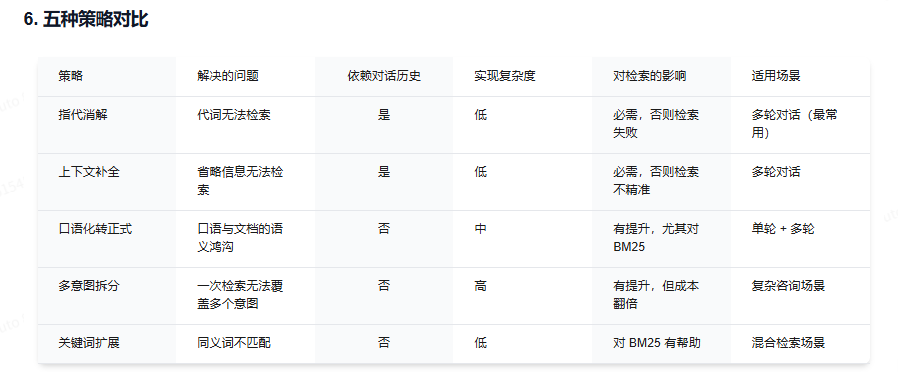
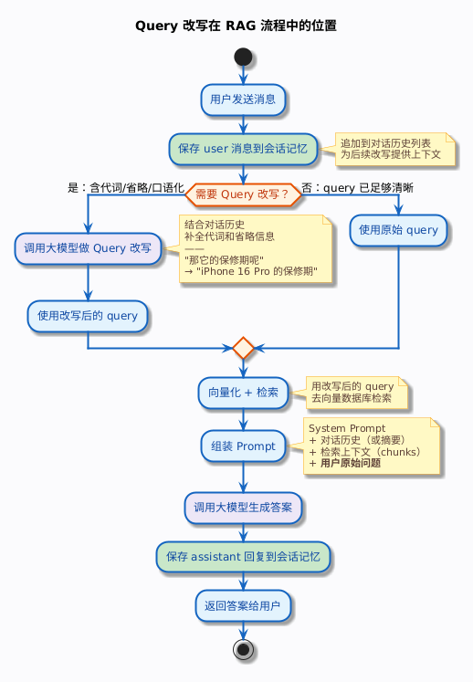
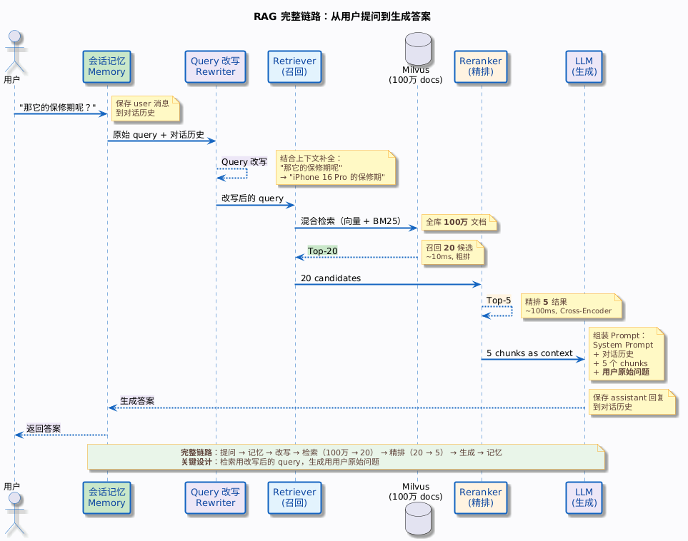

## 前言

就在刚刚，我们解决了模型对话的上下文问题，但是还没有结束，用户不是机器人，用户的问题不一定就非常准确，尤其是一个对话的后续补充，用户会简写一些问题，比如**它的政策是什么**，如果你直接拿这个Query去检索知识库，那你一定屁都检索不出来。

这种情况，就需要我们对用户的查询进行重写，以便于Rag系统去进行检索。

---

## Query检索的策略

### 1.指代消解

把代词替换为指代的具体实体

### 2.上下文补全

把省略的主语带上

### 3.口语化转正式

咋整 -> 怎么办。
咋还不到 -> 查询物流

### 4.多意图拆分

用户一句话多个问题 -> 拆解为多个子问题，对每个子问题进行检索，召回相关chunk，合并后形成答案

### 5.关键词拓展

主要是对BM25检索进行的关键词拓展，比如屏幕碎了 -> 屏幕碎裂 屏幕破损 屏幕维修 碎屏险等



---

## 改写方案（LLM）

### 设计改写Prompt

### 改写质量的影响因素

- 对话历史质量
- Prompt设计
- 模型能力

### 改写的时机

什么时候不用改写

- 第一轮对话
- Query本身已完整

何时必须改写

- Query包含代词
- Query包含省略的主语
- 多轮对话中的追问


```java
/**
 * 判断是否需要 Query 改写
 */
public boolean needsRewrite(String query, List<Message> history) {
    // 第一轮对话且 query 足够长，大概率不需要改写
    if (history.isEmpty() && query.length() > 15) {
        return false;
    }
    // 包含代词，需要改写
    if (query.matches(".*[它它的这个那个这些那些上面].+")) {
        return true;
    }
    // query 太短，大概率省略了上下文
    if (query.length() < 10 && !history.isEmpty()) {
        return true;
    }
    // 有对话历史的情况下，默认都改写（安全起见）
    return !history.isEmpty();
}
```
---

## 加入改写后，RAG的流程



**注意：拼接Prompt后返回给llm的用户问题是原始问题，问题改写只是为了方便知识库进行检索Chunks**

---

## 生产环境

生产环境的注意事项：

- 改写质量的保障，可以通过查询日志，获得改写的质量，以便进行优化。
- 改写失败兜底，当改写失败时，需要有一个兜底机制，返回原始问题，而不是空字符串。
- 改写缓存，同一个session内，用户可能多次输入相似的查询，可以使用Redis缓存保存改写结果，避免重复调用api

---

## 小结

本篇主要是介绍了查询重写和语义增强的方案，以及在生产环境需要注意的事项。

用户的质量往往是不清晰的，召回的结果会很差，所以需要进行语义重写，但是这里重写后的结果只是用来方便知识库进行检索，而不是用来直接回答用户的问题。




Updated on 5/16/2026